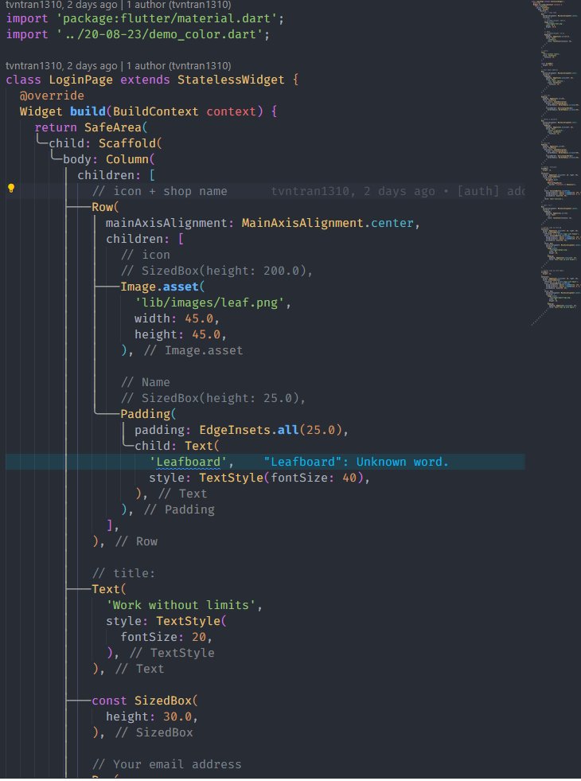

# FEEDBACK 20 -> 21-O8-2023

## Issue 1 (just share experience)

> Trong từng màn hình thì có những cái có đặc điểm chung nhưng chỉ khác thuộc tính, có thể sử dụng lại nên custom ra một cái widget để dùng lại thay vì vừa đồng bộ, dễ maintain vừa tránh lặp code

- T có ví dụ sẵn ở bài tập 3 ô vuông ở folder 20-08-23
- Trong folder 21-08-2023, cũng có những cái có thể sài lại được,

    - Tìm ra những cái có chung UI nhưng khác thuộc tính(liêt kê ra)
    - Custom những cái dùng riêng apply vào lại màn hình đó -> work đúng hay ko

------
## Issue 2 (UI issue)

> Thấy cái chi màu vàng vàng không? haha, xử lý chưa tốt nên là nó bị tràn nè

- Có thời gian thì đi hỏi tìm cách khắc phục cái này thử
- Đối với trường hợp này thì có 2 cách khắc phục:

  - Dễ nhất là bọc ở ngoài màn hình 1 cái widget có khả năng scroll
  - Còn muốn nâng cao hơn thì tìm hiểu:

     1. width, height có bao nhiêu loại gía trị có thể set
     2. Có cách nào get hoặc truyền cái width, height của widget cha hay ko để tk con có thể nhận hay ko
     3. set width/height của widget con theo kích thước get được từ bước 2

    Phía trên là 2 cách thông dụng t thấy họ hay dùng, có thể có nhiều cách khác hay         hơn, nếu tìm được thì share lại nha
    
> Trong code app thì có 2 yếu tố cần đảm bảo là đều và đối xứng

- Trong này thì thứ nhất là padding/margin của title text field, và các nút chưa bằng nhau

- Size của text field so với màn hình/ nút thì hơi bị to

---
## VSCode Trick

#### Tìm cách bật chế độ này ở vscode nhìn cũng tiện hơn nè

